# 東海中央ボーイズ 15期 道具割り振りツール 操作マニュアル

## 15期道具マネージャー向け — 最新マニュアル（公式参照URL）

**通知・引き継ぎ時は、必ず次のPDFのURLを案内してください。**

**https://tcb15-admin.github.io/tcb-tools/boys15/docs/TCB-MAN-001_道具割り振りツール_操作マニュアル_v1.5.pdf**

- マニュアルの正は **上記PDF** です（GitHub Pages 配信）。
- 内容を更新しても **URLは同じ** です。ブックマークはこのPDFアドレスで構いません。
- 通知文のひな型は同フォルダの `15期道具マネ_マニュアル通知文.md` を参照してください。

| 項目 | 内容 |
|------|------|
| 文書番号 | TCB-MAN-001 |
| 版 | 1.12 |
| 対象 | 15期 道具マネージャー |
| 作成日 | 2026年5月 |
| 最終更新 | 2026年7月5日（ツール v1.7.3・フロー図PDF改ページ対策） |
| **最新マニュアル（PDF）** | https://tcb15-admin.github.io/tcb-tools/boys15/docs/TCB-MAN-001_道具割り振りツール_操作マニュアル_v1.5.pdf |
| ツールURL | https://tcb15-admin.github.io/tcb-tools/boys15/ |
| 初期パスワード | `tcb15`（初回ログイン後、マスタ画面で変更可能） |
| バージョン確認 | 画面右上の「v1.7.3」表示 |

**画面イメージ** … 各操作の直後にスクリーンショットを掲載しています（実機画面の例）。

---

## このマニュアルの読み方

| 章 | 誰向け | 内容 |
|----|--------|------|
| **第1部 基本操作** | まずここだけ読めばOK | ログインから、割り振り・保護者共有・実施確定までの最短手順 |
| **第1部-B 利用シーン別フロー** | 場面に迷ったら | 代表的な6シーンのフロー図（日常の8割をカバー） |
| **第2部 詳細操作** | 慣れてから | 試合前・最小入れ替え調整、履歴、手直し、班跨ぎ手動、トラブル時の対処 |
| **第3部 マスタの更新** | メンバー・道具の変更時 | マスタ画面での編集とクラウドへの反映 |
| **付録A 割り振りロジック** | 保護者等から聞かれたとき | ツールがどんな考え方で担当を決めるか |
| **注意事項** | 必ず一読 | 試合メンバー情報の取り扱い、用具審査について |

スマートフォン・PC のブラウザ（Chrome、Safari、Edge など）で利用します。ブックマーク登録を推奨します。

---

## 注意事項（必読）

### 1. 試合メンバー情報の取り扱い

道具割り振りの準備のため、**公式戦・練習試合に限らず**、マネージャーから試合メンバーに関する情報が事前に共有されることがあります。

- チームから**正式に展開されるまで**、その情報は**口外しない**でください。
- 試合組・練習組に分かれる日は、**割り振り結果の見せ方**によって試合メンバーが推測されないよう配慮してください。
  - ツールの **「メンバー未発表」** にチェックを入れた状態で印刷・PDF を共有すると、試合組／練習組の見出しや「班」列を出さず、**担当者ごとの一覧**だけを表示できます（公式戦の前日などに有効）。
  - 道具の種類から推測されることは完全には防げませんが、**露骨な2分け表示は避けられます**。

### 2. 公式戦の用具審査

公式戦で使用する道具は、ボーイズリーグの用具審査の対象です。

- [ボーイズリーグ公式サイト](https://www.boysv.jp/) の **「ボーイズリーグの用具について」** など、**最新の審査情報**を確認してください。
- 審査基準外の道具がないか、割り振り・持ち出し前に**必ずチェック**してください。
- マスタに登録する道具名・実物が、審査対象と一致しているかも定期的に見直してください。

---

# 第1部 基本操作（ここだけで日常の割り振りができます）

## 1-1. ツールを開いてログインする

1. ブラウザで次のURLを開きます。  
   **https://tcb15-admin.github.io/tcb-tools/boys15/**
2. パスワード画面が出たら、初期パスワード **`tcb15`** を入力して「ログイン」。
3. 画面上部に **STEP 1｜2｜3** と、右上に **マニュアル・マスタ・履歴・v1.7.3** が表示されればOKです。

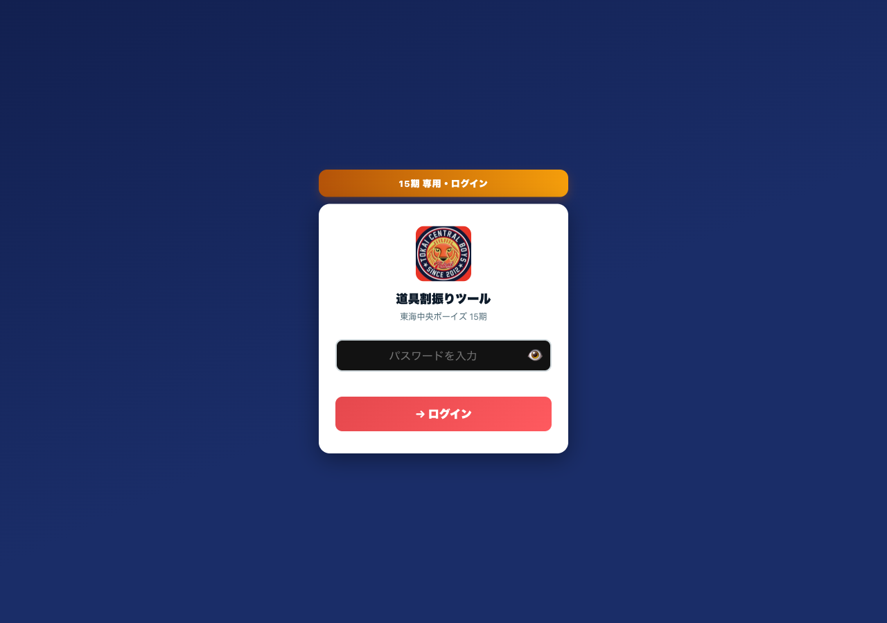

*図1-1：ログイン画面（パスワード入力 → ログイン）*

> **ヒント**  
> ホーム画面に追加（PWA）しておくと便利です（`manifest.webmanifest` 対応）。パスワードはマスタ画面から変更できます（第3部参照）。端末のダークモード設定に合わせて表示色が切り替わります。

---

## 1-2. いちばん多い「片方試合」の流れ（全体像）

公式戦・練習試合で「試合に出る組」と「練習する組」に分かれる日の標準手順です。

```
STEP1 活動設定 → STEP2 欠席・当番・グループ → STEP3 結果 → 展開情報 → 実施確定
```

| 段階 | やること | 覚えておくこと |
|------|----------|----------------|
| STEP1 | 日付・「片方試合」を選ぶ | 「メンバー未発表」は前日共有時はONのまま |
| STEP2 | 欠席・お茶当番・試合組メンバーを選ぶ | お茶当番は**翌日分**（その日は道具割り振りから外れる） |
| STEP3 | 結果確認・手直し | 「割振り実行」だけでは過去回数は増えない |
| 展開 | **展開情報を確認・LINE送信** | PDF プレビュー・LINE本文・保護者確認URLをまとめて送れる |
| 共有後 | **実施確定** | 保護者に連絡した内容で確定したら押す |

> **場面別の詳しい流れ** … 次の **第1部-B 利用シーン別フロー** を参照してください。

---

## 第1部-B 利用シーン別フロー

日常の割り振りで「今どの手順？」と迷ったときに、**利用シーンごとの流れ**を確認できます。ボタン名はツール画面の表記に合わせています。

### シーン早見表

| # | こんなとき | フロー |
|---|------------|--------|
| 1 | 前回確定を基準に、いつもどおり片方試合を割り振る | [フロー1](#フロー1前回の結果を元に片方試合を割り振る場合) |
| 2 | 試合前日、試合メンバーを伏せて保護者に送る | [フロー2](#フロー2試合前日メンバー未発表のまま共有する場合) |
| 3 | 欠席・班替えがあり、現地受け渡しで記録と実態がズレている | [フロー3](#フロー3欠席班替えがあり必要なら実保有を補正する場合) |
| 4 | LINE／PDF 送信後に担当を直した | [フロー4](#フロー4共有後に担当を直して再確定する場合) |
| 5 | 両方練習（場所分離）または両方試合の日 | [フロー5](#フロー5両方練習場所分離両方試合の場合) |
| 6 | 保護者確認 URL と交代報告を運用する | [フロー6](#フロー6保護者確認urlと交代報告を運用する場合) |

凡例（JIS フローチャート記号に準拠）：

| 記号 | 意味 |
|------|------|
| **二重丸** | 開始／終了 |
| **角丸四角** | 処理（1つの操作） |
| **菱形** | 判断・分岐 |
| **▼／▲** | ページまたぎ（次ページへ続く／前ページから続く） |

フロー図は **縦方向** に読み進めます。1操作1動詞で記載し、長いフローは改ページ位置で分割しています。

---

### フロー1：前回の結果を元に片方試合を割り振る場合

**いつ使う** … 前日または直前に **実施確定済み** の割振りがあり、今日の片方試合を最小変更で回す（**いちばん多い日常パターン**）。

**開始ボタン（いずれか）** … STEP1「前回の結果を元に割振る」／履歴詳細「前回の結果を元に割振り開始」／STEP3「最小変更で再調整」

> 前回確定データがない場合は、STEP1 で片方試合を選び **1-3〜1-5 の通常手順** へ進んでください。以下は **前回確定あり**（いちばん多い）パターンです。

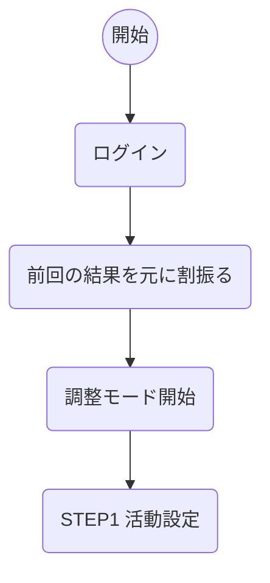
```mermaid
flowchart TD
    S((開始)) --> L(ログイン)
    L --> P1(前回の結果を元に割振る)
    P1 --> B(調整モード開始)
    B --> S1(STEP1 活動設定)
```

**▼ 次ページへ続く（フロー1・2/4）**

**▲ 前ページから続く（フロー1・2/4）**

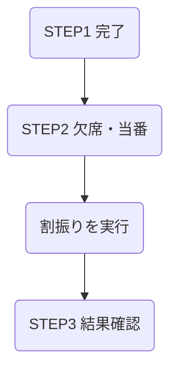
```mermaid
flowchart TD
    S1B(STEP1 完了) --> S2(STEP2 欠席・当番)
    S2 --> RUN(割振りを実行)
    RUN --> S3(STEP3 結果確認)
```

**▼ 次ページへ続く（フロー1・3/4）**

**▲ 前ページから続く（フロー1・3/4）**

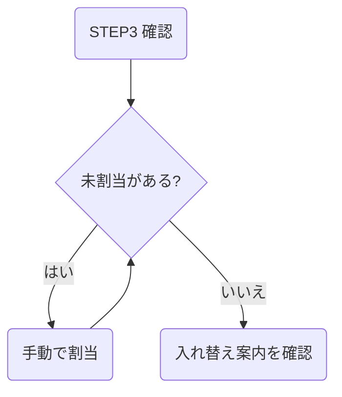
```mermaid
flowchart TD
    S3B(STEP3 確認) --> U{未割当がある?}
    U -->|はい| M(手動で割当)
    M --> U
    U -->|いいえ| H(入れ替え案内を確認)
```

**▼ 次ページへ続く（フロー1・4/4）**

**▲ 前ページから続く（フロー1・4/4）**

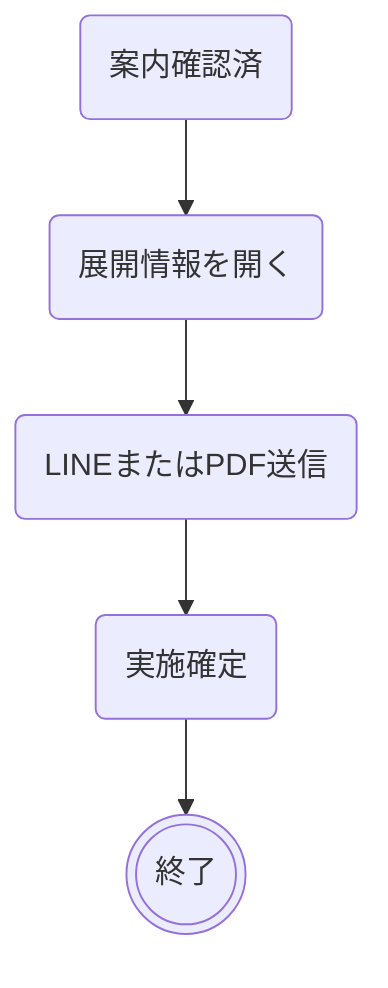
```mermaid
flowchart TD
    H2(案内確認済) --> SH(展開情報を開く)
    SH --> SEND(LINEまたはPDF送信)
    SEND --> CF(実施確定)
    CF --> E(((終了)))
```

| 参照 | 節 |
|------|-----|
| STEP1〜3 の詳細 | 1-3 〜 1-5 |
| 前回ベース調整の詳細 | 2-1 |

---

### フロー2：試合前日、メンバー未発表のまま共有する場合

**いつ使う** … 公式戦・練習試合の **前日夕方**、試合組／練習組の区別を出さず保護者へ連絡する。

**前提** … フロー1（またはゼロから割振り）で STEP3 まで完了していること。

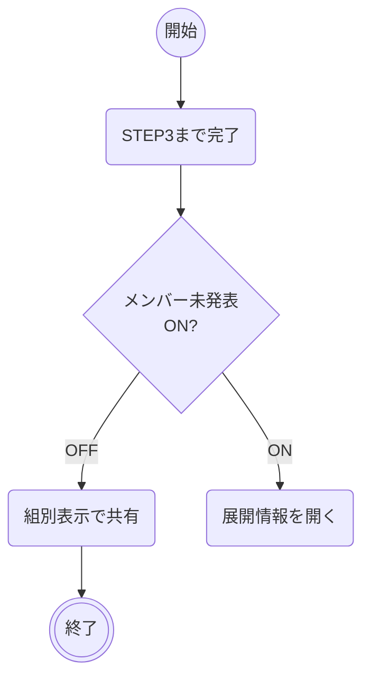
```mermaid
flowchart TD
    S((開始)) --> P3(STEP3まで完了)
    P3 --> MU{メンバー未発表<br/>ON?}
    MU -->|OFF| N(組別表示で共有)
    N --> E(((終了)))
    MU -->|ON| OP(展開情報を開く)
```

**▼ 次ページへ続く（フロー2・2/2）**

**▲ 前ページから続く（フロー2・2/2）**

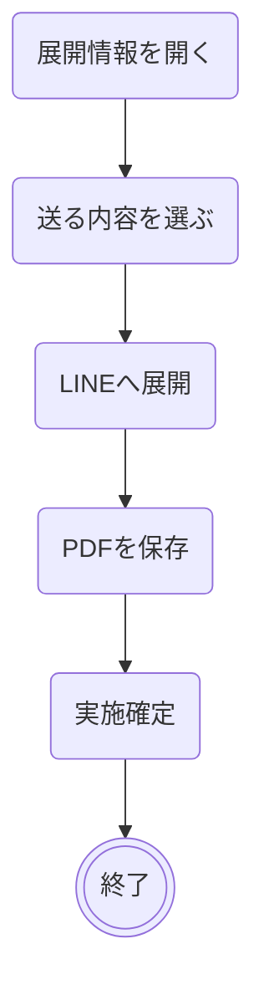
```mermaid
flowchart TD
    OP2(展開情報を開く) --> OPT(送る内容を選ぶ)
    OPT --> SEND(LINEへ展開)
    SEND --> PDF(PDFを保存)
    PDF --> CF(実施確定)
    CF --> E2(((終了)))
```

> **注意** … 保護者確認URLは実施確定後に有効（フロー6）。組名・班列は PDF に出ません（注意事項 1 参照）。

| 参照 | 節 |
|------|-----|
| メンバー未発表 | 1-3 |
| 展開情報 | 1-5 |

---

### フロー3：欠席・班替えがあり、必要なら実保有を補正する場合

**いつ使う** … 前回確定後に **現地受け渡し** や **欠席・班替え・お茶当番の変更** があり、入れ替え案内を実態に合わせたい。

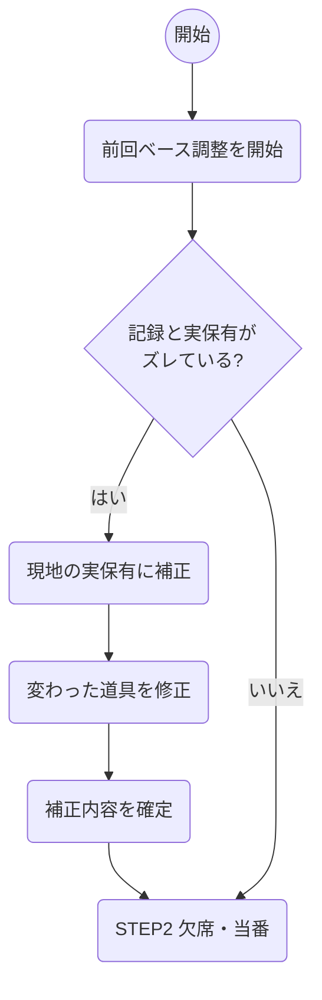
```mermaid
flowchart TD
    S((開始)) --> ST(前回ベース調整を開始)
    ST --> AH{記録と実保有が<br/>ズレている?}
    AH -->|はい| FIX(現地の実保有に補正)
    FIX --> EDIT(変わった道具を修正)
    EDIT --> SAVE(補正内容を確定)
    SAVE --> S2(STEP2 欠席・当番)
    AH -->|いいえ| S2
```

**▼ 次ページへ続く（フロー3・2/3）**

**▲ 前ページから続く（フロー3・2/3）**

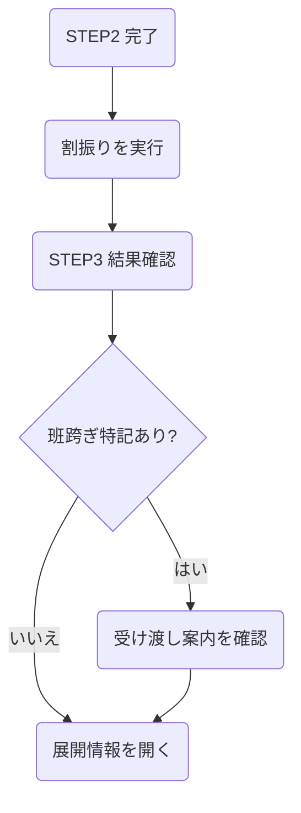
```mermaid
flowchart TD
    S2B(STEP2 完了) --> RUN(割振りを実行)
    RUN --> S3(STEP3 結果確認)
    S3 --> X{班跨ぎ特記あり?}
    X -->|はい| READ(受け渡し案内を確認)
    X -->|いいえ| SH(展開情報を開く)
    READ --> SH
```

**▼ 次ページへ続く（フロー3・3/3）**

**▲ 前ページから続く（フロー3・3/3）**

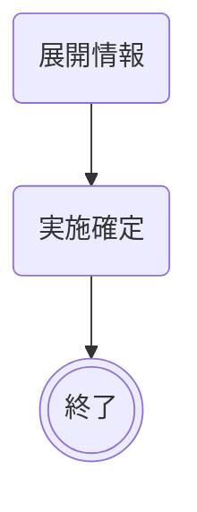
```mermaid
flowchart TD
    SH2(展開情報) --> CF(実施確定)
    CF --> E(((終了)))
```

| 参照 | 節 |
|------|-----|
| 実保有補正 | 2-1 |
| 班跨ぎ特記 | 1-5 |

---

### フロー4：共有後に担当を直して再確定する場合

**いつ使う** … LINE／PDF 送信 **後** に担当ミス・会場都合などで手直しが必要なとき。

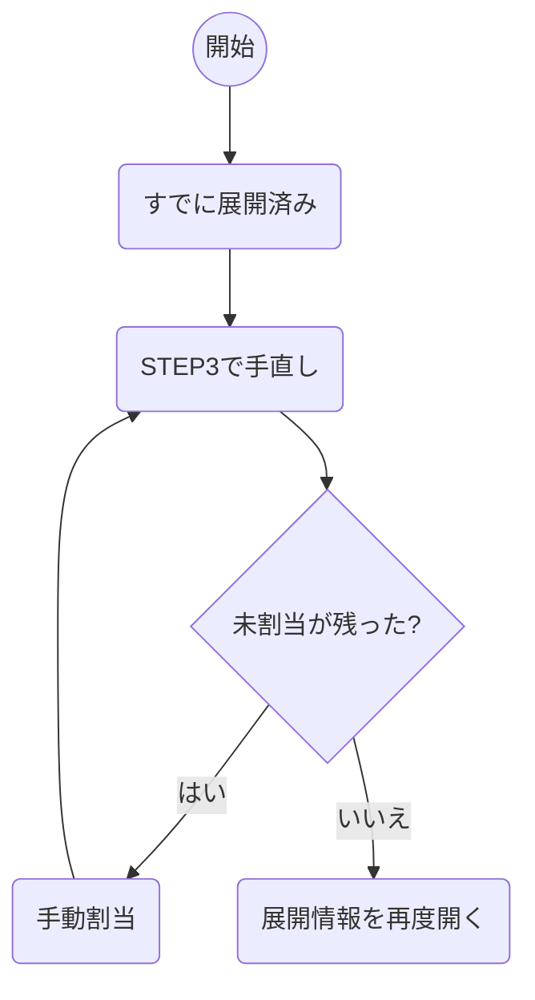
```mermaid
flowchart TD
    S((開始)) --> DONE(すでに展開済み)
    DONE --> EDIT(STEP3で手直し)
    EDIT --> U{未割当が残った?}
    U -->|はい| M(手動割当)
    M --> EDIT
    U -->|いいえ| RESH(展開情報を再度開く)
```

**▼ 次ページへ続く（フロー4・2/2）**

**▲ 前ページから続く（フロー4・2/2）**

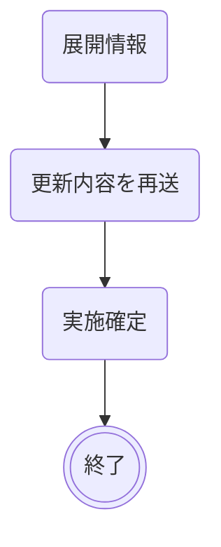
```mermaid
flowchart TD
    RESH2(展開情報) --> RESEND(更新内容を再送)
    RESEND --> CF(実施確定)
    CF --> E(((終了)))
```

> **覚えておく** … 「割振りを実行」だけでは PAST は増えません。**実施確定** が記録の確定ポイントです。

| 参照 | 節 |
|------|-----|
| 手直し・Undo | 1-5、2-2 |
| PAST のタイミング | 1-5 |

---

### フロー5：両方練習（場所分離）／両方試合の場合

**いつ使う** … 片方試合以外の活動パターン。以降はフロー1・2 と同様に展開 → 実施確定できます。

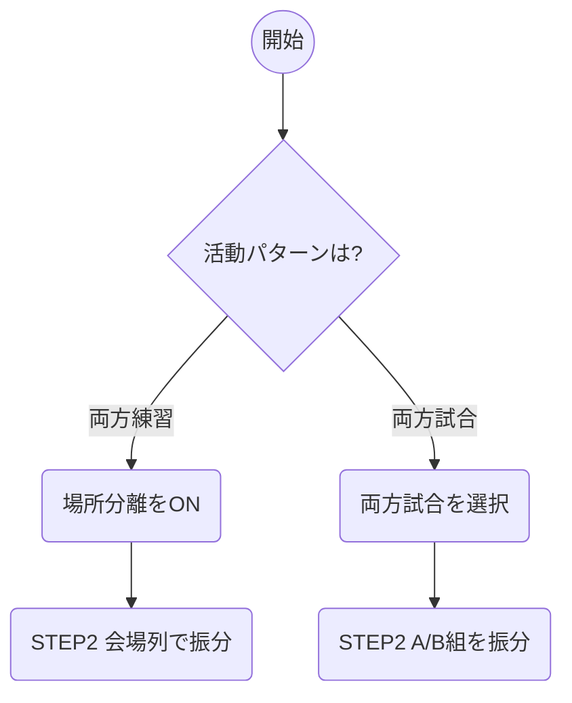
```mermaid
flowchart TD
    S((開始)) --> PAT{活動パターンは?}
    PAT -->|両方練習| R1(場所分離をON)
    R1 --> R2(STEP2 会場列で振分)
    PAT -->|両方試合| Y1(両方試合を選択)
    Y1 --> Y2(STEP2 A/B組を振分)
```

**▼ 次ページへ続く（フロー5・2/2）**

**▲ 前ページから続く（フロー5・2/2）**

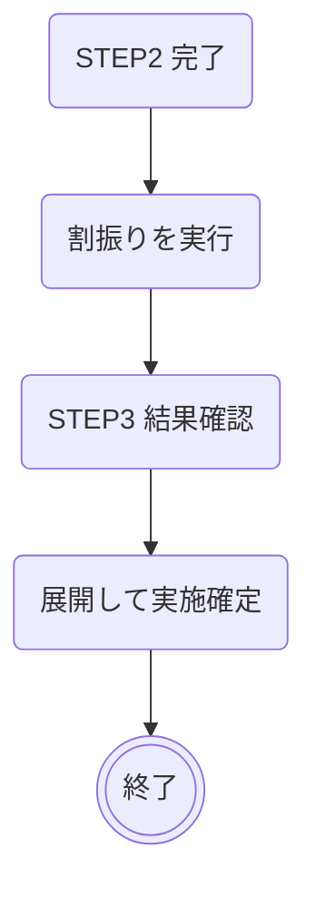
```mermaid
flowchart TD
    R2B(STEP2 完了) --> RUN(割振りを実行)
    RUN --> S3(STEP3 結果確認)
    S3 --> SH(展開して実施確定)
    SH --> E(((終了)))
```

| 参照 | 節 |
|------|-----|
| 両方練習 | 1-6 |
| マスタ会場列 | 3-3 |

---

### フロー6：保護者確認 URL と交代報告を運用する場合

**いつ使う** … 実施確定後、保護者がスマホで担当を確認し、現地の交代を報告する運用。

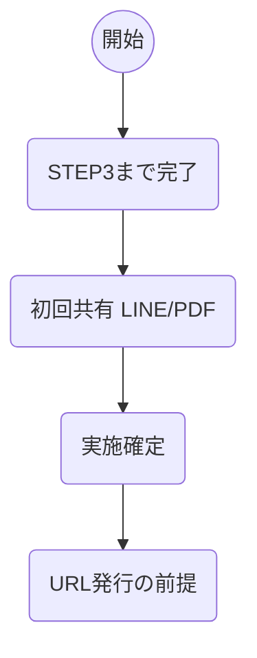
```mermaid
flowchart TD
    S((開始)) --> BASE(STEP3まで完了)
    BASE --> FIRST(初回共有 LINE/PDF)
    FIRST --> CF(実施確定)
    CF --> NOTE(URL発行の前提)
```

**▼ 次ページへ続く（フロー6・2/3）**

**▲ 前ページから続く（フロー6・2/3）**

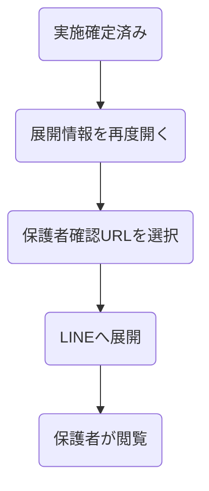
```mermaid
flowchart TD
    CF2(実施確定済み) --> OP2(展開情報を再度開く)
    OP2 --> URL(保護者確認URLを選択)
    URL --> LINE(LINEへ展開)
    LINE --> PV(保護者が閲覧)
```

**▼ 次ページへ続く（フロー6・3/3）**

**▲ 前ページから続く（フロー6・3/3）**

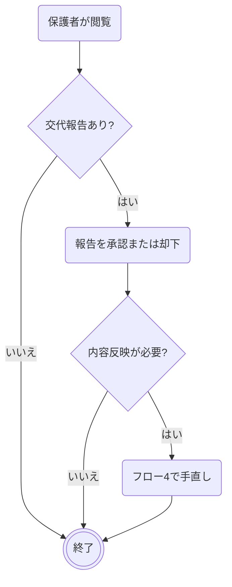
```mermaid
flowchart TD
    PV2(保護者が閲覧) --> REP{交代報告あり?}
    REP -->|いいえ| E(((終了)))
    REP -->|はい| MGR(報告を承認または却下)
    MGR --> NEED{内容反映が必要?}
    NEED -->|はい| F4(フロー4で手直し)
    NEED -->|いいえ| E
    F4 --> E
```

> **覚えておく** … 保護者確認 URL は **実施確定済みの直近2日分** が対象です。確定前は URL にチェックを入れられません。不要になったら「公開を停止」を利用します。

| 参照 | 節 |
|------|-----|
| 保護者確認・交代報告 | 2-4 |
| 展開情報 | 1-5 |

---

## 1-3. STEP1：活動設定

### 活動パターンを選ぶ

画面上部の3つのボタンから選びます。

| ボタン | 使う場面 |
|--------|----------|
| **片方試合** | 1試合だけ（試合組＋練習組に分かれる）← **いちばん多い** |
| **両方試合** | 同じ日にA・Bの2試合がある |
| **両方練習** | 全員で練習（試合なし） |

選ぶと、その下に青い説明バーが表示されます。

### 活動日

「活動日」で**その日の日付**を選びます（カレンダー入力）。

### グループ名（片方試合・両方試合）

「試合組」「練習組」などの名前は、必要なら12文字以内で変更できます（保護者向け印刷には、後述の「メンバー未発表」で出さない運用も可能）。

### メンバー未発表（重要）

片方試合・両方試合・練習で場所分離するときだけ表示されます。

- **チェックON（初期設定）** … 印刷・PDF・メンバー別タブで、試合組／練習組の**2段表示や「班」列を出しません**。担当者ごとの1一覧になります。
- **メンバー発表後** … チーム内確認用にチェックを外すと、従来どおり組別表示もできます。

### 前回の結果を元に割振る

STEP1 上部の **「前回の結果を元に割振る」** を押すと、直近の実施確定（または保存済みの割振り）を基準に **前回の結果を元に調整** モードで開始できます。前回の担当を最大限維持し、欠席・お茶当番・班替えの差分だけ自動調整します（第2部 2-1）。STEP3 の **「最小変更で再調整」** や **履歴** 詳細の **「前回の結果を元に割振り開始」** からも同モードを開始できます。

### 次へ

画面下の **「次へ：欠席・当番 ▶」** を押して STEP2 へ。

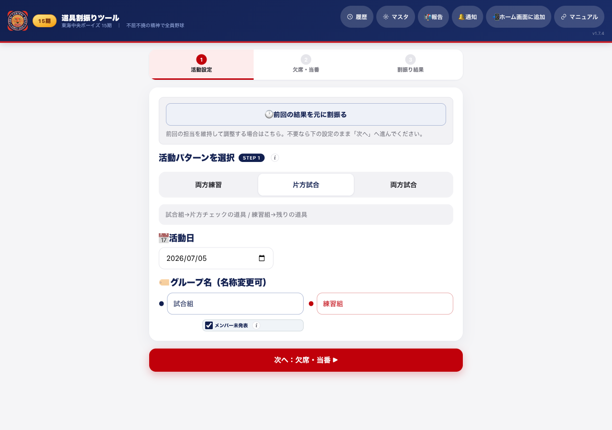

*図1-2：STEP1 — 「片方試合」・活動日・「メンバー未発表」（チェックONが初期値）*

---

## 1-4. STEP2：欠席・当番・グループ

### 割振り対象外（欠席など）

- メンバー名を**タップ**すると赤くなり、その日の割り振りから外れます。
- もう一度タップで解除。
- **休部・コーチ・14期帯同・兄弟所属**は最初から対象外（タップ不要／マスタ設定で指定）。

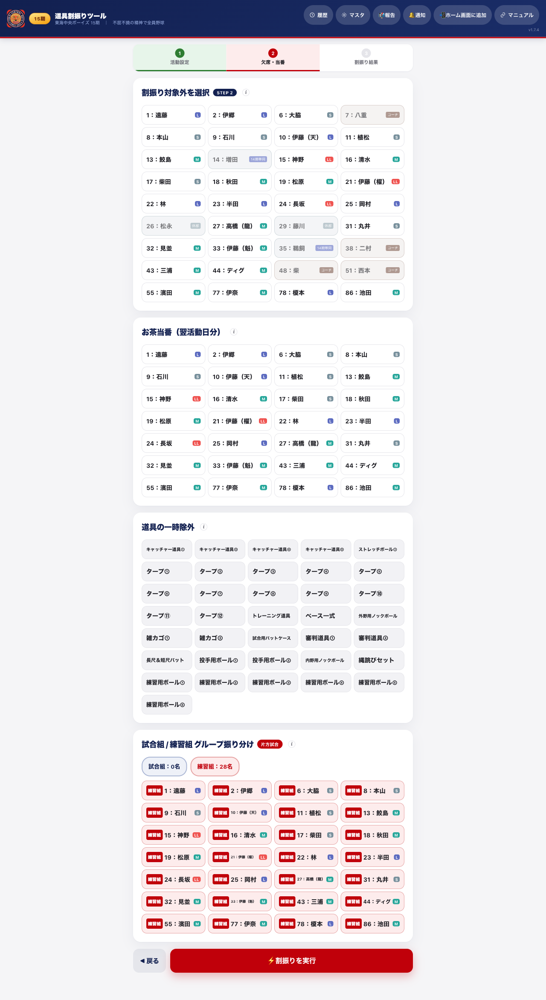

*図1-3：STEP2 — 欠席にする人をタップ（赤くなる）。コーチは灰色で最初から対象外*

### お茶当番（翌活動日分）

- 翌日のお茶当番になる人をタップ（オレンジ色）。
- お茶当番の人は**当日の通常道具の割り振りから外れます**（お茶道具を多く持ち帰る想定）。

### 道具の一時除外（その日だけ使わない道具）

- その日だけ割り振りに含めたくない道具をタップ。
- マスタの道具一覧は変わりません（この日だけの除外）。

### グループ振り分け（片方試合・両方試合）

**試合に出るメンバー**を選びます。

1. 最初は全員が**練習組側（紫）**です。
2. **試合組に入れる人**をタップすると、**試合組側（青）**に切り替わります。
3. 上部のカウンタで、試合組・練習組の人数を確認します。

> 会場や対戦で並びが変わる日は、**その日の情報**に合わせて並べ替えてから進めてください。

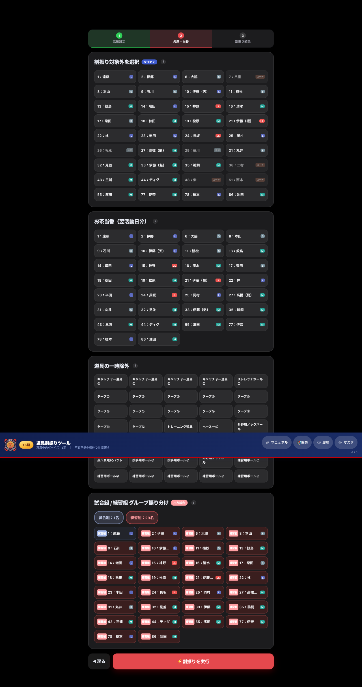

*図1-4：STEP2 下部 — 試合組に入れる人をタップ（青＝試合組、赤枠＝練習組）。上部の人数カウンタを確認*

### 割振りを実行

画面下の **「⚡ 割振りを実行」** を押します。

- 数秒で STEP3 に進み、道具ごとの担当者が表示されます。
- この時点では **過去担当回数（PAST）はまだ増えません**（試行・下書き用）。

---

## 1-5. STEP3：結果の確認と保護者への共有

### 画面の見方

- **道具別** … 表で道具と担当者を確認・変更
- **メンバー別** … 人ごとに持ち帰り道具を確認
- **展開情報を確認・LINE送信**（STEP3 下部の青ボタン） … 保護者共有用の PDF プレビューと LINE 送信画面を開く

上部の黄色い注意は、未割当の道具があるときに出ます。表の担当プルダウンで人を選ぶか、STEP2に戻って条件を見直してください。

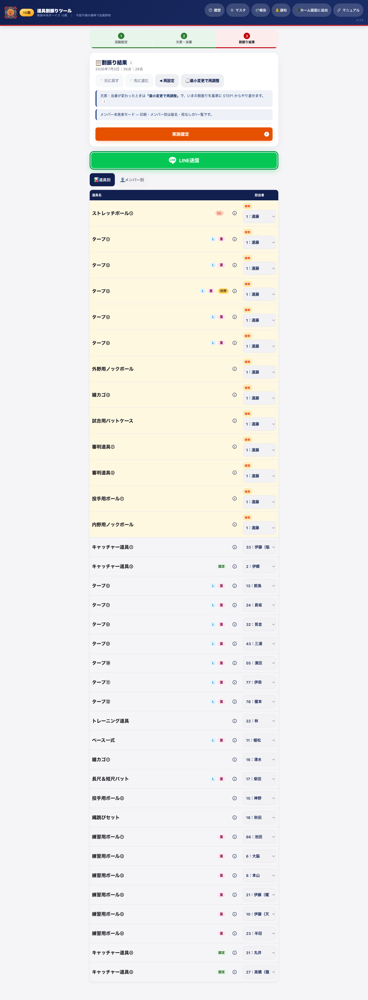

*図1-5：STEP3 — 道具別タブで担当確認。下部の「実施確定」は保護者共有のあとに押す*

### 担当の手直し（よくある操作）

道具別タブで、担当者の**プルダウン**から別の人に変更できます。**お茶当番・欠席の方も手動では選べます**（印刷では従来どおり除外表示）。

試合組／練習組がある日は、表の上にある **「班を問わず全員を担当候補に表示」** にチェックを入れると、プルダウンに全員が出ます（**手動割当のみ**。自動の「割振りを実行」は従来どおり班ごとです）。**前回の結果を元に調整** モード中は、このチェックが自動で ON になります。

班をまたいだ入れ替えがあるとき、STEP3 上部に **班跨ぎ受け渡しの特記**（橙色の案内）が表示されます。誰がどの班の誰に渡すかを確認してください。

### 保護者へ共有（展開情報の確認）

1. STEP3 下部の **「展開情報を確認・LINE送信」** をタップ。
2. 左側に **PDF プレビュー**、右側に **送る内容** のチェックと **定型文** が表示されます。

| 送る内容 | 説明 |
|----------|------|
| **LINE本文** | 定型文（編集可）＋入れ替え案内などの自動追記 |
| **保護者確認URL** | 実施確定済みの直近2日分を閲覧専用 URL で共有（実施確定後に有効） |
| **PDF添付** | PDF を一緒に送る（送信時は端末にも自動保存） |

3. **「LINEへ展開」** … Web Share API で LINE 等へ送れます（端末・ブラウザにより未対応の場合は **PDFを保存** を使う）。
4. **「PDFを保存」** … ブラウザの保存ダイアログで PDF を端末に保存（iPhone・Android・PC 共通）。
5. 配布済み URL を無効にしたいときは **「公開を停止」**。

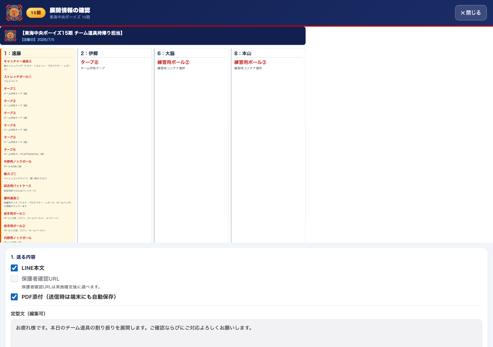

*図1-6：展開情報画面 — PDF プレビューと送る内容の選択。メンバー未発表ON時は組別見出しなし*

> STEP1で **メンバー未発表** がONのとき、組別の見出しは出ません（前日の共有向け）。

> **前回の結果を元に調整で実行したとき**  
> STEP3上部に紫色の **「入れ替え案内」** カードが出て、「誰と誰がどの道具を交換するか」がまとまります。カードの **「コピー」** で案内文をコピーでき、展開情報の LINE 本文・PDF 2ページ目にもこの案内が自動で入ります（詳細は第2部 2-1）。

### 実施確定（必ず忘れずに）

保護者へ連絡した内容が**確定**したら、STEP3の

**「この内容で実施確定（PASTに反映）」**

を押してください。

| タイミング | PAST（過去担当回数） |
|------------|----------------------|
| 割振りを実行しただけ | **増えない** |
| 実施確定を押したあと | **反映される**（次回以降の公平割り振りに使われる） |

同じ活動日で担当を直した場合は、もう一度 **実施確定** を押すと、その日のカウントを**差し替え**られます。

---

## 1-6. 両方練習のとき（参考）

1. STEP1で **「両方練習」** を選ぶ。
2. 練習場所が室内・屋外で分かれる日だけ、**「練習場所が分かれる」** にチェック。
3. STEP2では全員で割り振る（グループ振り分けは、チェックONのときのみ表示）。
4. 以降は STEP3 まで同じ。

---

## 1-7. 基本操作チェックリスト（活動日ごと）

- [ ] STEP1：活動日・パターンが正しいか
- [ ] STEP1：前日共有なら「メンバー未発表」ONか
- [ ] STEP2：欠席・お茶当番が正しいか
- [ ] STEP2：試合組メンバーがその日の並びと一致しているか
- [ ] STEP3：未割当の道具がないか
- [ ] 展開情報から保護者へ共有（LINE／PDF）
- [ ] 内容確定後に **実施確定** を押したか

---

# 第2部 詳細操作

## 2-1. 前回の結果を元に調整（最小限だけ直す）

前回の割り振りから、**同じ人が同じ道具を持てるよう最大限そのまま維持**し、欠席・お茶当番・班替え（練習組→試合組など）で必要になった部分だけを自動で入れ替えます。固定担当は維持されます。朝の集合が班別で、当日に道具を物理的に入れ替えられない日でも、前日に最小限の受け渡しだけで準備できるようにするためのモードです（旧称：試合前・最小入れ替え調整）。

### 開始方法（いずれか）

| 経路 | 操作 |
|------|------|
| 方法A | STEP1 **「前回の結果を元に割振る」** |
| 方法B | STEP3 **「最小変更で再調整」**（いま表示中の結果を基準） |
| 方法C | **履歴** → 活動日をタップ → 詳細の **「前回の結果を元に割振り開始」** |

### モード中の画面

- STEP1・STEP2 に **青い「前回の結果を元に調整」バナー** が表示されます。
- **活動日は本日** に設定されます（当日・翌日分の欠席・お茶当番・班替えを直す想定）。
- 活動パターン（片方試合／両方試合／練習）を変えても、**基準の担当配置は維持**されます。パターンを変えたあとは STEP2 で **割振りを実行** し直してください。
- 前回お茶当番だった人が今回通常参加に戻った場合など、**当番引き継ぎ**が反映されます。
- 前回欠席で今回参加する人には、余った道具を**優先して**割り当てます。
- **固定担当**の道具は変わりません。
- 前当番が基準メンバーにいない道具は **引き継がれない** ことがあります → STEP3 で手動割当。

### 現地の実保有に補正（入れ替え案内を実態に合わせる）

前回の割り振り確定後に、**現地での受け渡し**や**マスタの道具固定**によって、「前回の記録」と「実際にいま持っている道具」がズレることがあります。このまま調整すると、入れ替え案内（LINE／PDF）が実態と食い違ってしまいます。

- 試合前・最小入れ替え調整のバナーにある **「📦 現地の実保有に補正」** ボタンを押します（STEP1・STEP2 どちらのバナーからでも開けます）。
- 前回の割り当て一覧が出るので、**受け渡しで持ち主が変わった道具だけ**、プルダウンで **「いま実際に持っている人」** に直します（直した行は橙色になります）。
- **「この内容で補正する」** を押すと、補正内容が「前回持っていた道具」の基準になり、以降の入れ替え案内はこの**実態との差分**で作られます。
- まだ受け渡しがなく記録どおりなら、この補正は不要です。

### 入れ替え人数をできるだけ減らす仕組み

- 班（試合組／練習組）が入れ替わる道具は、可能なら **2名の相互交換**（AとBで道具をそのまま入れ替え）で処理します。
- それでも余る道具は、**すでに入れ替えが発生する人にまとめて**割り当てます。**一部の人がやや多く持つ代わりに、入れ替えに関わる家族の数を最小限**に抑えます。
- 変更のない人はそのまま維持されます（STEP3 の表で、維持＝緑、変更＝橙に色分け）。

### 入れ替え案内（STEP3・PDF・LINE）

STEP3上部の紫カードに、入れ替え内容が2種類に分かれて表示されます。

| 種類 | 意味 |
|------|------|
| **2名で道具を交換** | AさんとBさんが道具を**そのまま入れ替える**（相互交換）。お互い渡し合うだけで完結 |
| **その他の担当変更** | 一方向の受け渡し（欠席者の道具を別の人が引き継ぐ等） |

- カードの **「コピー」** で案内文をコピーできます。
- **展開情報** では2ページ目に、**LINE本文**にもこの案内が自動で入ります。
- 入れ替えがない場合は、カードもPDF2ページ目も出ません。

### 手順の例

1. 上記のいずれかで前回の結果を元に調整を開始。
2. （必要なら）バナーの **「現地の実保有に補正」** で、いま実際に持っている人へ直す。
3. STEP2 で欠席・お茶当番・グループ（試合組／練習組）を直す。
4. **「割振りを実行」** → STEP3 で結果と入れ替え案内を確認。
5. 必要ならプルダウンで手直し → 展開情報 → **実施確定**。

---

## 2-2. 元に戻す・先に進む（担当変更の取り消し）

STEP3右上の **「↶ 元に戻す」「↷ 先に進む」** で、担当プルダウンの変更履歴を辿れます。

---

## 2-3. 履歴

ヘッダの **「履歴」** から、過去の割り振り記録を確認できます。

| 操作 | 内容 |
|------|------|
| 行をタップ | その日の担当詳細 |
| 選択削除 | チェックした日を削除 |
| JSONで書出 | バックアップ用 |

「割振りを実行」のたびに端末へ保存された試行も含まれます。**実施確定した日**は「確定日時」が表示されます。

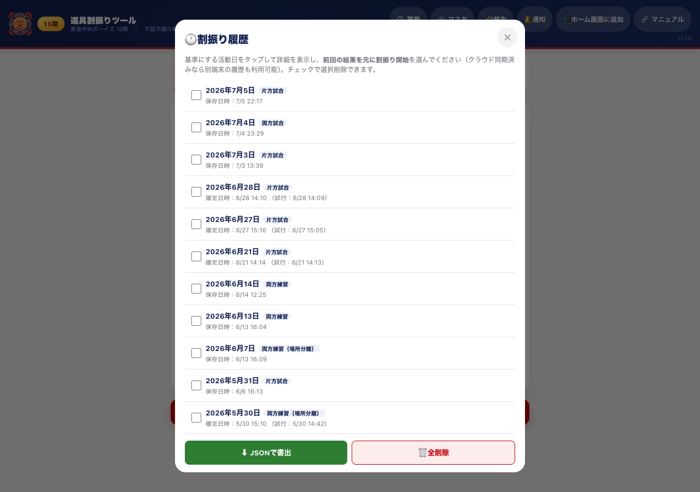

*図2-1：履歴 — 過去の割り振り・実施確定日時の確認*

---

## 2-4. 保護者確認ページと交代報告

実施確定後、展開情報の **保護者確認URL** を LINE で送ると、保護者は閲覧専用ページで担当道具を確認できます。保護者は **交代報告**（誰とどの道具を交換したか等）を送信でき、道具 MGR はヘッダの **「報告」** ボタン（未処理件数バッジ付き）から **承認** または **却下** します。

| 操作 | 内容 |
|------|------|
| URL 発行 | 展開情報で「保護者確認URL」にチェック → **LINEへ展開**（実施確定済みが前提） |
| 報告の確認 | ヘッダ **「報告」** → 一覧から承認／却下 |
| URL 無効化 | 展開情報の **「公開を停止」** |

---

## 2-5. 道具の写真・説明

道具別一覧の **「📷 写真」** ボタン（登録がある道具のみ）で、持ち帰り時の注意を表示できます。内容はマスタの「道具の説明・写真」で編集します（第3部）。

---

## 2-6. よくある質問

| 質問 | 答え |
|------|------|
| 過去回数はいつ増える？ | **実施確定**を押したときだけ |
| 割振りを何度も押すとPASTは？ | 実施確定するまで増えない。試行は端末に保存される |
| 別のスマホで同じ結果を見たい | マスタ・履歴はクラウド同期。共有は展開情報の PDF が確実。履歴から**前回の結果を元に割振り開始**を別端末で開始することも可能 |
| 未割当の道具が出る | 欠席で人数が足りない、負荷上限、固定担当の条件など。手動で担当を選ぶかSTEP2を見直す |
| 公式戦前に組名を出したくない | STEP1の **メンバー未発表** をONのまま展開情報で PDF／LINE 送信 |
| お茶当番なのに道具を手動で付けたい | 自動割振りでは外れるが、STEP3プルダウンでは選べる（PDF は除外表示） |
| 公平に再分配ボタンがない | 本ツールはシンプルUI。未割当はプルダウンで手動割当 |
| 保護者確認URLが出ない | **実施確定** 後に展開情報を開く。直近2日分の確定データが対象 |
| 交代報告が届かない | 保護者が確認ページから送信。MGR はヘッダ **「報告」** で確認 |
| 「2名で道具を交換」と「その他の担当変更」の違いは？ | **2名で道具を交換**は2人が道具をそのまま入れ替える相互交換（お互い渡し合うだけ）。**その他の担当変更**は一方向の受け渡し（例：欠席者の道具を別の人が引き継ぐ） |
| 入れ替え案内が実態と違う（すでに現地で受け渡し済み） | 前回の結果を元に調整のバナー **「現地の実保有に補正」** で、いま実際に持っている人へ直してから割振りを実行する |
| 試合前調整で一部の人に道具が偏る | 意図的な仕様。入れ替えに関わる**人数を減らす**ため、変更が発生する人にまとめています。分散したいときは STEP3 で手動調整 |
| 累計が少ない人に偏る？ | v1.6.4 以降、班内中央値より低い累計に**ボーナスは付きません**（多い人だけやや後回し） |
| 旧PAST（回数）と混ざる？ | シーズン初めにマスタ「PAST をゼロにリセット」を推奨 |
| パスワードを忘れた | 15期管理担当へ連絡（初期値の再設定・変更手順） |

---

# 第3部 マスタの更新

マスタとは、**メンバー一覧・道具一覧・道具の説明・過去担当回数（PAST）** のことです。  
15期では **クラウド（Cloudflare同期）** に保存され、**「保存」ボタンで全端末に反映**されます。

## 3-1. マスタ画面を開く

1. 割り振り画面のヘッダ右上 **「⚙ マスタ」** をタップ。
2. メンバー・道具・説明を編集します。
3. 必ず下の **「💾 保存」** を押して終了します（押さないと他の端末に反映されません）。


*図3-1：マスタ — メンバー・道具・説明の編集。編集後は必ず「保存」*

---

## 3-2. メンバー一覧の更新

| 操作 | 手順 |
|------|------|
| 追加 | 「＋ メンバー追加」 |
| 削除 | 行の削除操作 |
| 並び替え | 行のつまみ（≡）をドラッグ |
| 休部・コーチ | 該当チェックをON |
| 14期帯同・兄弟所属 | 該当チェックをON（割振り対象外） |
| 積載区分 | 名前右のプルダウン（S/M/L/LL）… 車のサイズに応じた負荷上限に使用 |

**背番号：名前** の形式（例：`12：山田太郎`）にしておくと、印刷・一覧の並びが分かりやすくなります。

### メンバーの読込・書出（上級）

「読込」「書出」でJSON形式のやり取りができます。通常は画面から直接編集で十分です。

---

## 3-3. 道具一覧の更新

| 列・項目 | 意味 |
|----------|------|
| 試合用A/B | 片方試合で、どちらの組の道具か（A＝試合側寄り、B＝練習側寄り） |
| 片方 | 片方試合で割り振る対象か |
| 重さ・長さ | 割り振りの負荷計算に使用 |
| 固定・担当者名 | 毎回その人に割り当てる道具 |
| 故障 | 割振り表・PDF に「故障」タグを表示（使用継続中の故障道具向け） |
| 会場 | **両方練習で場所分離するときのみ**（室内＝A、屋外＝B） |

道具を追加・削除したあとも **保存** を忘れずに。

---

## 3-4. 道具の説明・写真

各道具の説明文・写真URLを登録します。割り振り結果の「写真」ボタンに反映されます。

---

## 3-5. 保存の流れ（クラウド同期）

1. 編集が終わったら **「保存」**（画面上部または最下部）。
2. 通信が成功すると、他のマネージャーの端末でも次回アクセス時に同じマスタが読み込まれます。
3. 画面に成功メッセージが出ることを確認してから **「閉じる」** で割り振り画面へ戻る。

> マスタを変えたあと、**すでに実施確定済みの過去回数**まで意図せず変わっていないか、初めての保存時は確認してください。

### バックアップ（任意）

保存時に `master.json` がダウンロードされることがあります。バックアップ・記録用として保管して構いません。通常の運用では **保存＝クラウド反映** で足ります。

---

## 3-6. マスタを元に戻す（誤操作時）

| ボタン | いつ使うか |
|--------|------------|
| 開いた時点に戻す | 今回マスタを開いてから保存していない編集を取り消す |
| 端末の保存を読み直す | 直近「保存」した内容に戻す |
| 初期マスタに戻す | 同梱の初期データに戻す（**慎重に**） |

いずれも、そのあと **保存** するまでクラウドには反映されません。

---

## 3-7. パスワード変更

マスタ画面内の「パスワード変更」で、ログイン用パスワードを変更できます。変更後は **保存** してください。

---

## 3-8. PAST（過去担当回数）のリセット

シーズン初めなど、累計をゼロから始めるときだけ使います。**実施確定の記録も消えます**。使用後は必ず **保存**。

---

# 付録A：割り振りロジックの考え方（他者への説明用）

保護者やコーチから「なぜこの人にこの道具？」「公平なの？」と聞かれたときに、道具マネージャーが説明するための要点です。**ツールは次の考え方で自動割り振り**しています（STEP3で手動変更した場合は、その結果が優先されます）。

## A-1. まず押さえる3つの柱

| 柱 | 内容 |
|----|------|
| **公平** | これまでの担当回数（PAST）と、**その日**すでに振られた道具の数・重さを見て、偏りにくくする |
| **安全** | メンバーごとの**積載区分（S/M/L/LL）**に応じて、重い道具・長い道具の本数に上限がある |
| **その日の事実** | 欠席・お茶当番・試合組／練習組・マスタの道具設定だけを見る。**未来の予定や過去の別日の割り振りは自動では参照しない** |

## A-2. その日の入力がすべての前提

「割振りを実行」の時点で、次だけが効きます。

- **STEP1** … 活動パターン（片方試合／両方試合／両方練習）、活動日
- **STEP2** … 欠席、**お茶当番（翌活動日分＝その日は通常道具から外れる）**、その日だけの道具除外、試合組／練習組の振り分け
- **マスタ** … 道具一覧（試合用A/B・片方対象・重さ・長さ・固定担当・会場）、メンバーの積載区分

## A-3. どの道具を、どのメンバー候補に振るか

活動パターンによって、道具とメンバーの組み合わせ候補が決まります。

| パターン | 道具の分け方 | メンバーの分け方 |
|----------|--------------|------------------|
| **片方試合** | マスタの「片方」＋試合用A/B（A＝試合側寄り、B＝練習側寄り） | STEP2で指定した**試合組**と**練習組** |
| **両方試合** | 試合用A/B列（A試合・B試合） | 試合組A・試合組B |
| **両方練習** | 全道具（除外したもの以外） | 全員（欠席・お茶除く） |
| **両方練習・場所分離** | マスタの**会場**（室内＝A、屋外＝B）。未設定はA/B列に従う | 室内組・屋外組 |

このあと、各グループ内で**1道具ずつ**担当者を決めます。

## A-4. 1道具ずつ担当を決める順番（イメージ）

1. **固定担当**（マスタで「固定」＋担当者名）… 原則その人へ。車の上限などは緩めて割り当てます。
2. **単独持ち帰りの道具**（ベース一式、長尺／短尺バットなど）… **その道具だけ**を持つ人にする。同じ人に他の重い道具を足しにくい。
3. **重い・大きい道具を先に** … タープや重い用具など、負荷の大きいものから割り当て。
4. **軽い道具** … 状況により、すでに担当がある人の荷物に**同乗**できる場合があります（雑カゴなど）。

同じ条件の人が複数いるときは、次の**優先度スコアが小さい人**から選びます（数が小さいほど先に選ばれる）。

```
pastPenalty ＝ √（max(0, 累計負荷PAST − 班内の中央値)）
優先度 ＝ pastPenalty × 1 ＋ 当日の負荷スコア × 1 ＋ 当日の担当件数 × 6
```

- **PAST（累計負荷）** … 「実施確定」を押した活動だけ、道具の重さ・長さ（lscore）を**加算**。**割振りを実行しただけでは増えません。** メンバー別タブでは「N回相当」と表示（目安）。
- **中央値より低い累計** … 自動割振りで**優先されません**（少ないから集中しない）。
- **中央値より高い累計** … やや後回し（長期の偏りを抑える）。

また、**直前の割り振り試行**や**前回の実施確定**を参考に、同じ道具を**同じ人に続けて振りにくく**しています（単独道具は特に）。

## A-5. 車（積載区分）ごとの上限

メンバー名の右の **S / M / L / LL** は、家族の車の大きさの目安です。道具の重さ・長さに応じて、**1人がその日に持てる本数**に上限があります。

| 区分 | 重い道具（Heavy 等） | 超ロング（LL） | ロング（L） |
|------|----------------------|----------------|-------------|
| S | 少なめ | 原則不可 | 少なめ |
| M | 標準 | 1本まで等 | 標準 |
| L / LL | やや多め | 多め | 多め |

このため、欠席者が多い・大型道具が多い日は **未割当** が出ることがあります。そのときは STEP3 で手動割当するか、STEP2 の条件を見直します。

## A-6. 「前回の結果を元に調整」のとき

欠席・お茶当番・班替えを直したいときは、**前回の割り振り map を基準**に、同じ人が同じ道具を持てるよう最大限維持し、変わったメンバーに関係する道具だけを再配分します。固定担当は維持。活動パターンが前回と違っても map ベースで調整できます（STEP2 で割振りを実行し直す）。活動日は調整開始時に**本日**に設定されます。前当番が基準にいない道具は引き継がれないことがあり、STEP3 で手動割当します。

**入れ替え人数の最小化**：班が入れ替わる道具はまず2名の相互交換で処理し、余った道具は「すでに入れ替えが発生する人」へ集中させます。一部の人がやや多く持つ代わりに、入れ替えに関わる家族の数を減らす設計です（保護者の負担を最小化）。誰がどの道具を交換するかは STEP3・展開情報の PDF 2ページ目・LINE 本文の「入れ替え案内」で確認できます。班跨ぎの受け渡しは STEP3 の特記表示も参照してください。

**現地の実保有に補正（v1.6.8）**：入れ替え案内は「前回持っていた道具」との差分で作ります。前回確定後に現地で受け渡しがあった／マスタで道具を固定したなどで記録と実態がズレている場合は、バナーの「現地の実保有に補正」で実際の持ち主へ直してください。補正した内容が差分の基準になり、案内が実態に一致します。

## A-7. 手動変更・実施確定の位置づけ

| 操作 | ロジックとの関係 |
|------|------------------|
| STEP3の担当プルダウン変更 | 自動割り振りの結果を**上書き**できる（会場都合・配慮など）。お茶当番・欠席も手動では選択可 |
| 班跨ぎチェック | **手動プルダウンのみ**全員表示。自動割振りは班ごと |
| 割振りを何度も実行 | 試行。**PASTは変わらない** |
| **実施確定** | 保護者に連絡した内容を「本番」として記録し、**次回以降の PAST に反映** |

## A-8. よく聞かれる質問への答え方（例）

| 質問 | 説明のポイント |
|------|----------------|
| なぜ息子にタープが多い？ | その日の担当件数・負荷・PASTを見ている。実施確定前の試行はカウントに入らない。手動変更もある |
| 前と同じ人ばかり？ | 同じ道具を連続で避けるが、完全なローテーション表ではない。PASTで長期的な偏りを抑える |
| 不公平では？ | 完全な均等ではなく、**重い道具の安全**と**累計の公平**のバランス。疑問があれば STEP3 の内訳を見せられる |
| お茶当番なのに道具がある？ | お茶当番は**翌活動日分**。当日の通常道具割り振りとは別 |

---

# 付録B：画面一覧（STEP）

| STEP | 名称 | 主な入力 |
|------|------|----------|
| 1 | 活動設定 | パターン、活動日、メンバー未発表 |
| 2 | 欠席・当番 | 欠席、お茶、グループ、割振り実行 |
| 3 | 割振り結果 | 確認、展開情報、実施確定 |

## 付録B-3：利用シーン別フロー早見

| # | シーン | 開始の入口 | メンバー未発表 |
|---|--------|------------|----------------|
| 1 | 前回ベースで片方試合 | STEP1「前回の結果を元に割振る」 | 用途に応じて |
| 2 | 試合前日の伏せ共有 | フロー1の STEP3 後 | **ON** |
| 3 | 欠席・班替え＋実保有補正 | フロー1と同じ＋補正ボタン | 用途に応じて |
| 4 | 共有後の手直し | STEP3 プルダウン | — |
| 5 | 両方練習／両方試合 | STEP1 でパターン選択 | 場所分離時は可 |
| 6 | 保護者確認・交代報告 | 実施確定 → 展開情報 | — |

詳細フロー図は **第1部-B** を参照。

## 付録B-2：連絡先・引き継ぎ

| 項目 | 内容 |
|------|------|
| ツール不具合・パスワード | 15期管理担当（リポジトリ管理者）へ |
| 用具審査の解釈 | ボーイズリーグ公式情報を正とし、必要ならチーム内で確認 |

---

**文書末尾** — 版 1.12（2026-07-05、ツール v1.7.3・フロー図PDF改ページ対策）。仕様の詳細はリポジトリ内 `boys15/docs/TCB-SPEC-001` 等を参照。本書は15期道具マネージャー向けの操作手順に特化しています。
